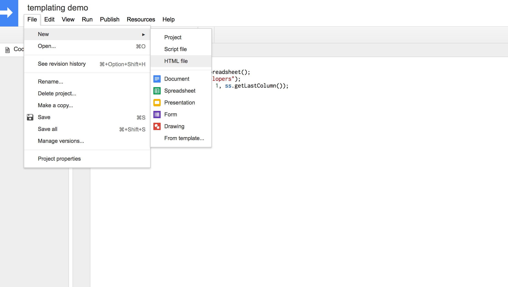

# Learning html templating with Google Apps Script

This readme explores how to visualise data from a Google Sheets Spreadsheet in a web app that can be run in the browser.

The idea for this was borne out the need for a better visual tool for viewing and comparing data from applicants to the [Founders & Coders](www.foundersandcoders.com) bootcamp. Since a Google Form is used for the application itself, it made sense to continue to use Google products for the process of reviewing and selecting candidates.

For my demo I use a more generic example of comparing applicants for a developer role.

This readme assumes basic working knowledge of web development (HTML and JavaScript) and of Google Sheets. Google Apps Script is a very powerful tool, and so this is a quick introduction to HTML templates for beginners.


## Quick intro to writing scripts for Google Sheets

This section provides a very brief explanation of Google Apps Script for those with little to no prior knowledge.

Like macros in MS Excel, Google Apps Script (GAS) allows you to write scripts that can read, edit and manipulate your spreadsheets. You can also do lots of other things with it, like read files from your Google Drive or send emails from your Gmail account.

GAS is Javascript based and - if you're already familiar with Javascript - pretty easy to pick up. The syntax for interacting with your spreadsheet is similar to that for interacting with the DOM in vanilla Javascript.

Instead of querying the DOM for HTML elements, you can access sheets, rows, columns and other ranges of data and their values.

However, unlike regular client side JS, GAS is run server-side, i.e. on Google's servers. It can therefore be a lot slower than what we're used to with the browser.

Here's an example of how we can get data from the first row in a [table](https://docs.google.com/spreadsheets/d/1bV2zhcos61W5cUaRL7seumiGBiYJX5QZVa8qeBNLx9A/edit?usp=sharing):

```js
//from a table of job applicants
function getFirstApplicant() {
  var ss = SpreadsheetApp.getActiveSpreadsheet(); // you need this to start!
  var sheet = ss.getSheetByName("developers");  // the sheet I'm working on
  var firstRow = sheet.getRange(2, 1, 1, ss.getLastColumn()); // the range I'm working with : 2nd row, 1st column, 1 row, all columns with data in
  return firstRow.getValues()[0] //.getValues() returns a 2D array of data from the table, of which we want just the first subarray, i.e. row;
}

Logger.log(getFirstApplicant()); // with Apps Script you have a Logger instead of a console!
 // logs: [Emily, emilyb7, Developer, Javascript]
```

For a much more detailed explanation of any of the above concepts, I'd recommend checking out [Google's own documentation](https://developers.google.com/apps-script/reference/spreadsheet/).


## Introducing HTML templates

HTML templates allow us to extend GAS's powers and turn our scripts in client-side web apps that can be run in the browser.

The main use case here is for [add-ons](https://developers.google.com/apps-script/add-ons/) that users can install and use in combination with other Google web apps like Google Sheets itself. It can also be used to create HTML email templates and to send them out via Gmail.

In this case, however, we're making a standalone web app which we can deploy either for private or public use and which will be hosted by Google.

To create an HTML template, go to ```file >> new``` in the Google Script Editor and select 'HTML file' from the menu.



Your new HTML file should have some HTML pre-loaded into it. You can add regular HTML, css and javascript to this, just as you would if you were writing code for the browser. As far as I can tell, all the regular functionality - like manipulating DOM elements and logging to the browser console - is available to us.

You can use your web app to interact with the data in your spreadsheet in two ways:

1. **scriptlets**: scriptlets are mini scripts that can be incorporated into the body of your HTML. A bit like using a server-side templating language, the scripts run server-side before the page is loaded. You can use functions from your scripts in your scriptlets in order to access data from a spreadsheet.

2. **from within script tags**: in order to continue to interact with your data *after your page has loaded* you can use server-side script to make a call to your spreadsheet. Like regular Javascript, you can add this in between `<script>` tags within your HTML document.

To briefly sum up what we've looked at so far, here's how I would compare the GAS package (or at least the parts of it I'm using) to regular web development:

| Google Apps | Web |
| --- | --- |
| Data in a spreadsheet | Database |
| Spreadsheet App | Nice database client |
| Google Script | Server-side code |
| Google HTML file | An HTML template served up by your server |

## Making our app

As the basis for my app, I started out with this [simple spreadsheet](
https://docs.google.com/spreadsheets/d/1bV2zhcos61W5cUaRL7seumiGBiYJX5QZVa8qeBNLx9A/edit?usp=sharing
).

We want to take the data in this spreadsheet and present it in a more readable manner (assume that in reality there is a lot more data being collected in our application form, and so the spreadsheet becomes unreadable).

I won't go through the code in the ```.gs``` file here, as it's not the purpose of this readme. Instead I will focus on the ```template.html```, which can be viewed either in the script editor of the spreadsheet or as uploaded to this repo.

The deployed web app can be viewed [here](https://script.google.com/macros/s/AKfycbxdJY3xoJWj028yF3D6a6eYywn2eR3oWNvxAgbQ1ltlKoVJeXIk/exec).

### Getting the document ready

Let's start with an HTML-only version and add in the scripts a bit at a time. Our basic HTML (with a bit of CSS) looks like this:

```html
<html>
  <head>
    <base target="_top">
    <title>HTML Templating demo</title>
    <style>
      body {
        margin: 10px;
      }

      #btn {
        text-decoration: underline;
        cursor: pointer;
      }

      #github_img {
        height: 300px;
        width: 300px;
      }
    </style>
  </head>
  <body>
    <h1>Applicants</h1>
    <form>
      <p><em>Select an applicant from the list to see their details</em></p>
      <select id="select">
      <option disabled selected value> -- select -- </option>
      </select>
      &nbsp;<a id="btn">Display</a>
    </form>
    <hr>
    <p><strong>Name:</strong> <span id ="devName">-</span></p>
    <p><strong>GitHub:</strong> <span id="devGithub">-</span></p>
    <p><strong>Role:</strong> <span id="devRole">-</span></p>
    <p><strong>Favourite programming language:</strong> <span id="devLanguage">-</span></p>

    <p><strong>GitHub avatar</strong></p>
    
    <footer><a href="https://github.com/emilyb7/html-templating-with-google-apps-script" target="blank">About this page</a></footer>
  </body>
</html>
```

### Running our app

In order to get our app to work, we need to make sure that our script contains a ```doGet()``` function. This sets up the connection between the script and the HTML template. An HTML template cannot be run as a web app without a script. I've already added this function to code.gs.

```js
function doGet() {
  return HtmlService
  .createTemplateFromFile('template') // where template is the name of our html file!
  .evaluate();
}
```
We can check out what our app looks like by clicking on ```Publish >> Deploy as web app``` and then clicking on "latest code".

You'll be taken to the development version of your app, which you can use for testing at any time.

Our page has no functionality and does not load any data, but the structure is now there.

First we need to work on the drop-down menu, which should list the names of the applicants in the spreadsheet. These names need to be available before the page loads, so we'll use a scriptlet.

### Loading data with scriptlets

Scriptlets can be as simple as ```<?= new Date() ?>``` or ```<?= 1 + 5 ?>```, but the most obvious use case is to return data from a spreadsheet via a function.

In ```Code.gs``` I've written a function ```getApplicants``` that returns an array of all applicants' names.

We'll use a loop to add an ```<option>``` to our select field for each of the applicants in the array.

The syntax for a loop is as follows:

```
<? var array = [];
      for (var i = 0; i < array.length; i++) { ?>
        <p><?= array[i] ?></p> // the p tags can be replaced by any html element!
    <? } ?>
```

Check out my solution to see how I solved this for the app we're building. You can view the [docs for writing scriptlets](https://developers.google.com/apps-script/guides/html/templates) here.

### Client-side rendering

For our single page app, we need to be able to load in data from the spreadsheet without having to refresh the page.

The rest of our script will be added in separately between ```<script>``` tags.

**Note**: do this at the end of your body and **not** in the head, else the page won't render properly.

The loading of data for new applicants is triggered by a click event on the "display" button, for which we can use a regular event listener, same as on a regular web page. But the syntax for *retrieving data* from our spreadsheet is a little different from a regular client-side request to a server.

In order to simply run a function from our script, we can use this syntax:

```
google.script.run.doSomething();
```

This won't work for us though, as the code in our browser runs synchronously, while getting the data we need takes a while as we need to get it from a server. We need to wait for our data to be returned before attempting to update our page. Thus we need to use a success handler, which is basically like a callback.

There are probably different ways to implement this, but my solution is similar to this:

```js
var data = google.script.run.withSuccessHandler(function (data) {
  /* do things to DOM */
}).getData();
```

Note that error handling is also possible (known as failure handlers), but that I haven't gone down that road yet.

You can read the full docs for client-to-server communication [here](https://developers.google.com/apps-script/guides/html/communication).

### Deploying our app

If you want to deploy your app for your own use, or for other people, you can do so by clicking on ```publish >> delpoy as web app```.

You can choose whether to keep your app private or public. In order to re-deploy your app (i.e. if you make changes) then you need to deploy it as a new version (under 'project version'). Click on update and you'll be given the new URL for your app.

Here are a few more learnings:
- Users need to be logged into Google in order to use an app
- Apps are 'sandboxed' and run as an iframe - read more about this [here](https://developers.google.com/apps-script/migration/iframe){:target="_blank"}

Here's another link to the working version of the app: https://script.google.com/macros/s/AKfycbxdJY3xoJWj028yF3D6a6eYywn2eR3oWNvxAgbQ1ltlKoVJeXIk/exec
